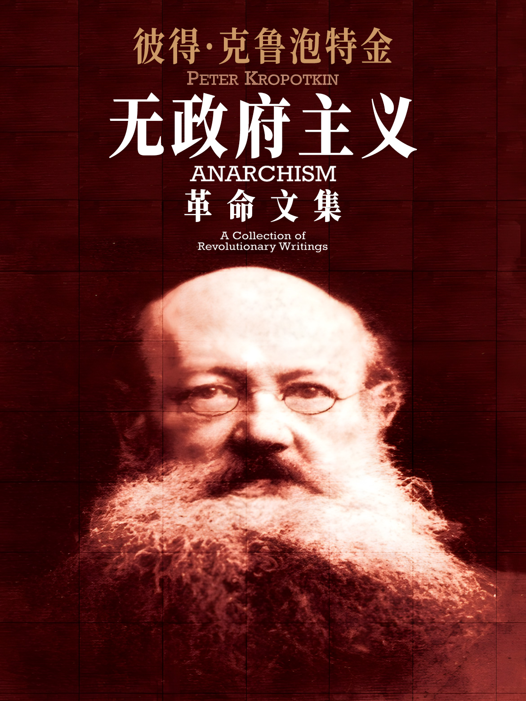

# 无政府主义 : 革命文集

> 开始阅读：【[在线版](https://anartigone.github.io/ACRW-web/)】【[下载版](https://github.com/anartigone/ACRW-web/releases/)】

------

## 0x00 如何阅读

- 【PC/手机】用户均可从这个链接[直接阅读](https://anartigone.github.io/ACRW-web/)
- 【手机】用户若加载时间过长，也可以阅读纯文字版：
 - [注册](https://github.com/join?source=header-home) 一个 Github 账号
 - 点击此项目仓库([ACRW-web](https://github.com/anartigone/ACRW-web))右上角的 **Star** 和 **Fork** 按钮
 - 从 Google/App Store 搜索并安装 APP 【Github】 并登录
 - 在【仓库】中找到 [ACRW-web](https://github.com/anartigone/ACRW-web)，点击打开
 - 点击【浏览代码】可打开仓库文件，在路径 `gitbook/markdown/zh` 下即为各个章节的内容
- 希望热心的读者能积极参与纠错、反馈阅读中遇到的各种问题，电报群：[未竟共同体](https://t.me/+Ps3zrIsWwH1jMjE5)

## 0x10 内容预览

## 0x20 项目简介

这是《无政府主义 : 革命文集》 WEB 版的汉化项目，也是[re0-web](https://github.com/re-zero-khis/re0-web)的一个fork。全书的完整汉化流程包括：

1. 翻译（英 -> 中）
2. 润色（使得上下文表达语句意思更贴近中文环境）
3. 校对（专有名词修正、所有章节一致化）
4. 编排（文档格式）

这是一个知识开源计划的项目。翻译环节用的是[电子书翻译器 (ETCP)](https://github.com/bookfere/Ebook-Translator-Calibre-Plugin)的自定义引擎(DeepL+自定义词汇表)，润色和校对环节用的是Qwen2-Instruct，但每个环节同样**需要每个读者的参与和反馈** (欢迎随时提issue/开discussion) 、优化排版和修复注释链接 (欢迎直接pr、私信、加群讨论译法) 。

更多翻译详情请见[汉化电子书经验谈](https://writee.org/anartigone/ebook-talk)

> 当一个文本与真理和信条等同，当它无需意义的中介而在自己的字面上成为“真正的语言”，这个文本就具备了无条件的可译性。在这种情况下，人们只是因为语言的多样性而需要翻译。
>
> ——瓦尔特·本雅明《译作者的任务》

为了提供高质量的机翻文本作为开源翻译的基底，本项目参考了拉黑字幕组译作中的用语习惯，制作出上千行的自定义词汇表以确保专业术语的翻译准确性，而非[沉浸式翻译](https://github.com/immersive-translate/immersive-translate)那种无脑机翻。在对比过谷歌翻译、DeepL和各种语言模型之后，最终选择用DeepL初翻+Qwen2.5修复润色+Python排版+人工校对的方式生成了可读性较高的翻译结果。

>“只要眼睛多，bug容易捉。”
>
> ——埃里克·雷蒙《大教堂与集市》

在未来，绝大多数商业公司/出版社所采用的“大教堂”模式将被开源世界采用的“集市”模式所取代。这个变革不应局限于软件行业，也应燎原于文化领域。让书友们像程序员给软件源代码排错那样，来校对自由开源的电子书吧！

## 0x30 相关资源

- 本书相关
	- 中文资源
		- [彼得·阿历克塞维奇·克鲁泡特金](https://www.marxists.org/chinese/kropotkin/index.htm)
		- [上帝与国家-巴枯宁](https://www.marxists.org/chinese/bakunin/mia-chinese-bakunin-1870-1871.htm)
		- [无政府主义精选文库](https://github.com/anartigone/anlib)
		- [【人物访谈】美国安那其——大卫·格雷伯〖熟肉｜去广告｜附书单资源〗](https://www.bilibili.com/video/BV1e1DyYmEEp)
	- 英文资源
		- [Anark](https://www.youtube.com/channel/UC1CjJYTUeor8EUFsbgwu5TQ)
		- [Zoe Baker](https://www.youtube.com/channel/UC3FD64RRsrCLpiZNkq7ZkSg)
		- [Andrewism](https://www.youtube.com/channel/UCN__G2hSqRKuqedN3M0JCDg)
		- [Srsly Wrong](https://www.youtube.com/channel/UCam_6nCM4Yd-zmAOz6IYLNg)
		- [The Skeptical Leftist](https://www.youtube.com/channel/UCIw_d_Ek2L2KNjgT5H7ObdA)
		- [Post-Anarchism and Psychoanalysis with Duane Rousselle](https://youtu.be/S0pz5SBHIQ8)
		- [Radical Reviewer](https://www.youtube.com/c/RadicalReviewer)
		- [The Anarchist Library](https://theanarchistlibrary.org)
- 翻译相关
	- [Re0：从零开始的异世界生活 （WEB 版）](https://github.com/re-zero-khis/re0-web)
	- [电子书翻译器 (ETCP)](https://github.com/bookfere/Ebook-Translator-Calibre-Plugin)
	- [翻译的现代性：译者任务、机械复制时代与文本星丛 S2EP24 - 例外状态 State of Exception](https://www.xiaoyuzhoufm.com/episode/63269c8da5d434d0ee90cc0d)
	- [Vol 27 “翻译”作为一种女性主义实践 - 歧义 Disagreement](https://www.xiaoyuzhoufm.com/episode/6429a7301a5480d95859e6f8)
	- [李新雨｜翻译之为精神分析家的任务](https://m.thepaper.cn/newsDetail_forward_29092693)
	- [《译作者的任务》瓦尔特·本雅明](https://www.marxists.org/chinese/walter-benjamin/mia-chinese-walter-benjamin-1921a.htm)
	- [《汉化电子书经验谈》安娜提戈涅](https://writee.org/anartigone/ebook-talk)

## 0x40 许可证和版权

代码基于GNU通用许可协议第三版发布：[GPLv3](https://www.gnu.org/licenses/gpl-3.0.html)

这是自由软件：你可以自由地修改和重新发布它。 在法律允许的范围内，**不提供任何保证**。

翻译内容遵循知识共享许可协议 (保持署名—非商用—相同方式共享)：[CC BY-NC-SA 4.0](http://creativecommons.org/licenses/by-nc-sa/4.0/)

允许修改和无通知转载，请附上本仓库链接及本声明，**禁止商用**。

## 0xF0 致开发者

此项目是利用 [Honkit](https://github.com/honkit/honkit) 搭建的，同时兼容在 [Github Pages](https://github.com/anartigone/ACRW-web) 和 [本地（线下）](http://127.0.0.1:4000/) 运行。

> 关于 **本地** 环境的搭建可见 [honkit-docker-support](https://github.com/honkit/honkit#docker-support) 的说明

